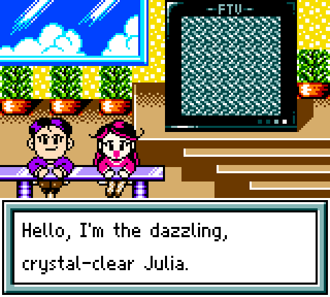
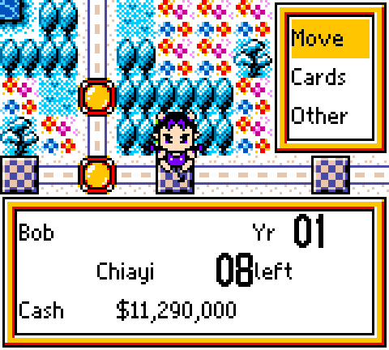
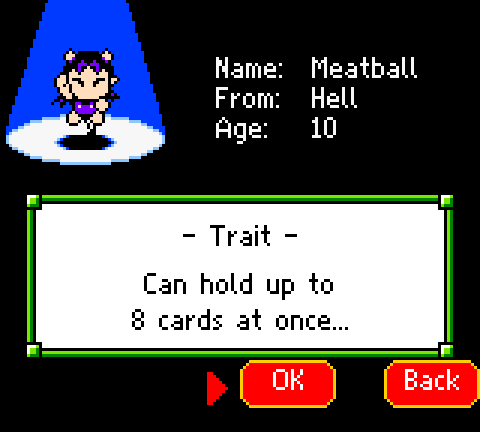
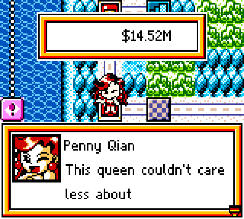
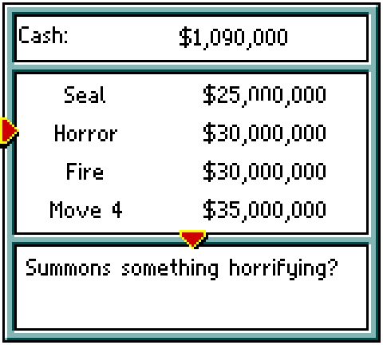
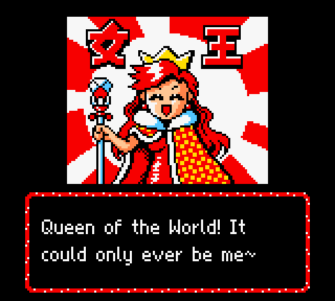

# Crazy Tycoon: English translation of 瘋狂大富翁 (Feng Kuang Da Fu Weng), Game Boy Color

> [!IMPORTANT]
> **This translation was made by AI.** The script, the reworked graphics and the code changes were produced by an
> AI model (Anthropic's Claude), directed and play-tested by a human. No professional or fluent human translator
> reviewed it, so expect mistakes, odd phrasing and the occasional bug.
>
> **If you enjoy fan translations, please support the humans who make them.** Play their releases, report bugs,
> credit them, contribute to their projects, and check whether a human translation of a game exists before reaching
> for an AI one. This patch is no substitute for their work.

**[Patch your ROM in the browser](https://gopherbone.github.io/fengkuangdafuweng_en/)**, or download the IPS
patch from the [latest release](https://github.com/gopherbone/fengkuangdafuweng_en/releases/latest).

Feng Kuang Da Fu Weng ("Crazy Rich Man") is an unlicensed Taiwanese Game Boy Color board game in the style of
*Richman* / *Monopoly*: race around Taiwan, buy land and businesses, play cards on your rivals, and watch the VF News
report on the chaos. This patch translates it into English.

More in [`docs/screenshots/`](docs/screenshots/).

## What's translated

- All dialogue, news broadcasts, events, card names and descriptions, menus and prompts, drawn with a new
  proportional English font and word wrap.
- Money is shown in dollars (`$13,920,000`) instead of units of 10,000 (萬).
- Pre-drawn graphics: title menu, save slots, setup, character select and profiles, character intro stories,
  the goal roulette, town name bubbles, the status panel, shops, the Other menu (Assets, Setup), the forced-sale
  screen, year-end tables, month splashes, the robot battle banner, and every character's ending.
- Name entry uses an English keyboard (up to 6 letters).
- Character names use a hybrid localization: Meatball, Dubi, Penny Qian, Wu No-Guts, Sachiko, Hanamura, Xianglan
  and Xiao Ming.

## The ROM you need

This patch doesn't include the game. Use your own copy of:

| | |
|---|---|
| File name | `Feng Kuang Da Fu Weng (Unlicensed, Chinese) (Multicart Rip) [Header Fix].gbc` |
| Size | 2,097,152 bytes (2 MiB) |
| CRC32 | `AD68B3DD` |
| MD5 | `0302066cf764b39159922594f31e3445` |
| SHA-1 | `72d3b05ca1bd08b646c3a3240fcc29f630958825` |
| Header title | `POKMON'FIGHT` |

The patched ROM has CRC32 `0590E59E` (SHA-1 `9e6dfc9da8d387a30d40d70a8ac168319187066d`). Both header checksums
are valid.

## How to patch

- **In the browser:** open the [web patcher](https://gopherbone.github.io/fengkuangdafuweng_en/) and drop your ROM
  on it. It checks the ROM, patches it locally (nothing is uploaded) and gives you the patched file.
- **With an IPS patcher:** apply `crazy-tycoon-en.ips` (from the release, or
  [`docs/crazy-tycoon-en.ips`](docs/crazy-tycoon-en.ips)) to the ROM above with Floating IPS, Lunar IPS,
  Rom Patcher JS or similar.

Play it on a Game Boy Color emulator (SameBoy, mGBA, Gambatte…) or on hardware with a flash cart.

## Known issues

- This is an AI translation; phrasing may be off in places. Corrections are welcome as issues or pull requests.
- Left in Chinese because they're artwork: the 瘋狂大富翁 title logo, the publisher's logo, the 恭喜發財 New Year
  banner in February's picture, and the 女王 ("Queen") lettering in Penny Qian's ending.
- The forced-sale screen's message box sits half off the right edge of the screen (the original does the same), so
  its longer English lines are cut off.
- Some screens were checked only as rendered graphics, not reached in play: the year-end tables, the robot battle
  banner, and seven of the eight endings.

## Building from source

You need Python 3 and [RGBDS](https://rgbds.gbdev.io/) (`rgbasm`, `rgblink`, `rgbfix`) on your `PATH`; Pillow is only needed to regenerate graphics.

1. Put the original ROM at `orig/fkdfw.gbc`.
2. `python3 tools/build.py` writes `build/fkdfw_en.gbc`.
3. `python3 tools/make_ips.py` writes `docs/crazy-tycoon-en.ips` and its hash file.

`gfx/patch.json` is committed, so a plain build doesn't need anything else. Regenerating some graphics
(`tools/gfx.py`, `tools/gfx_*.py`) and the test tools need local emulator save states and a scriptable SameBoy command-line build (neither is
included), located with the `SAMEBOY_CLI` / `GBEMU` environment variables.

## Project layout

| Path | Contents |
|---|---|
| `asm/` | The English text engine (proportional font, word wrap, dollar formatting) and ROM hooks |
| `script/` | Extracted script (`strings.json`), translations (`tl_out/`, `tl_review/`), glossary, intro and ending text |
| `font/` | Glyph tables for the original Chinese font and the English font |
| `gfx/` | Graphics specs and the generated graphics patch |
| `tools/` | Extractor, builder, graphics generators, IPS maker, test and survey tools |
| `notes/` | Reverse-engineering notes |
| `docs/` | GitHub Pages site: web patcher, IPS patch, screenshots |

## Legal

This is an unofficial fan translation, not affiliated with the game's developer or publisher. Only a patch is
distributed; no game code or ROM is included.
